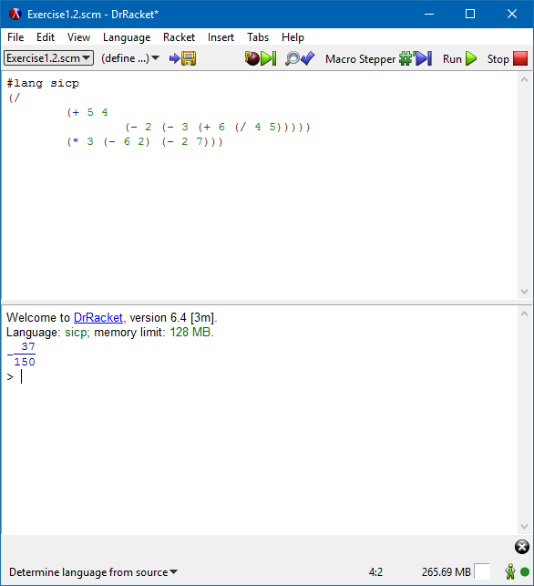

To work through the [Structure and Interpretation of Computer Programs (SICP)](https://mitpress.mit.edu/sicp/) exercises in the `Wizard Book`, I am using DrRacket; see https://racket-lang.org/, as the IDE and Scheme REPL.

### Additional References
* [Racket Documentation](https://docs.racket-lang.org/)
* [SICP Collections](https://docs.racket-lang.org/sicp-manual/index.html)
* [SICP Support for DrRacket](http://www.neilvandyke.org/racket/sicp/)
* [Which lang packet is proper for SICP in Dr.Racket?](http://stackoverflow.com/a/19561746/6146580)
